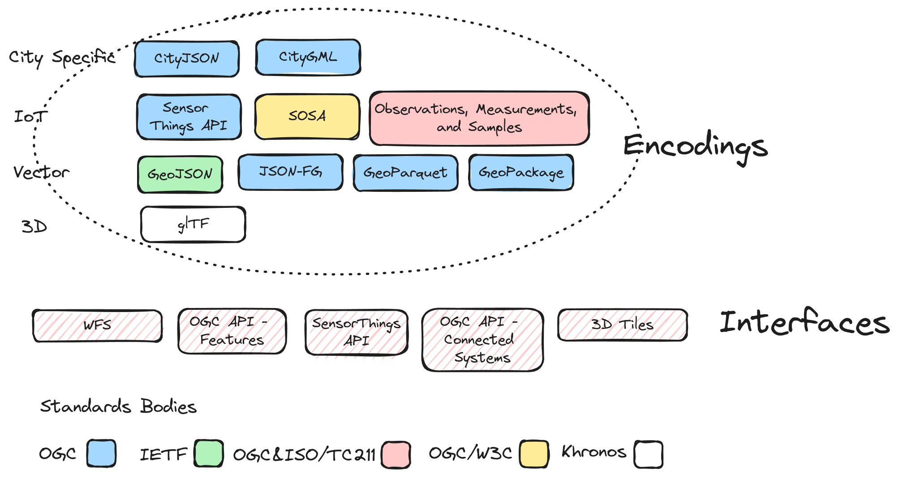
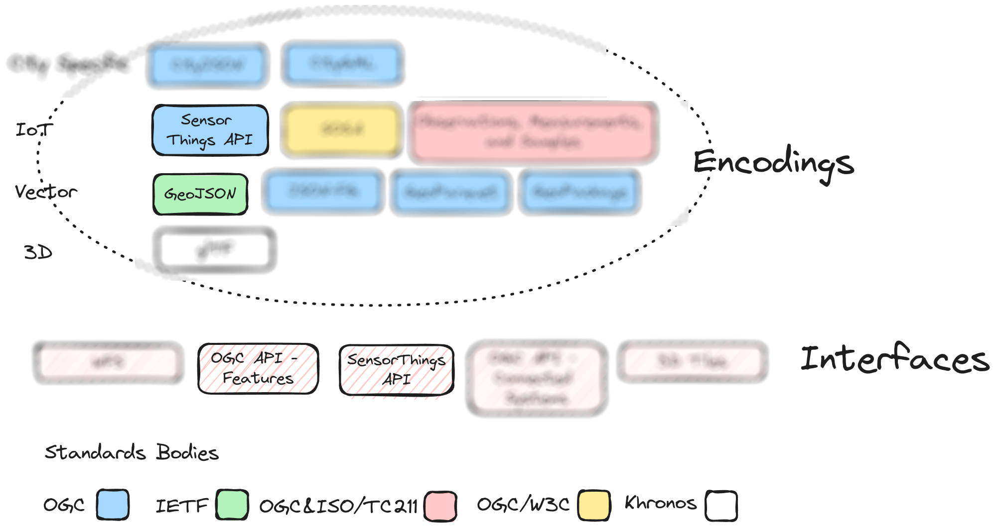
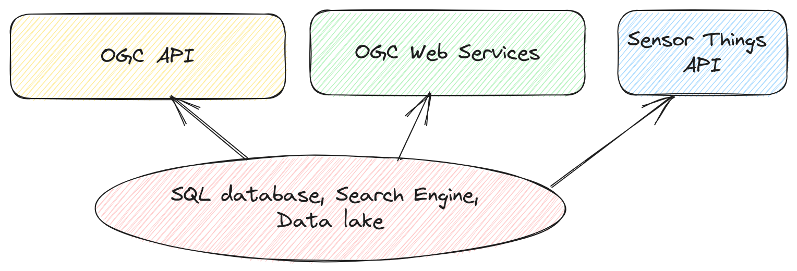
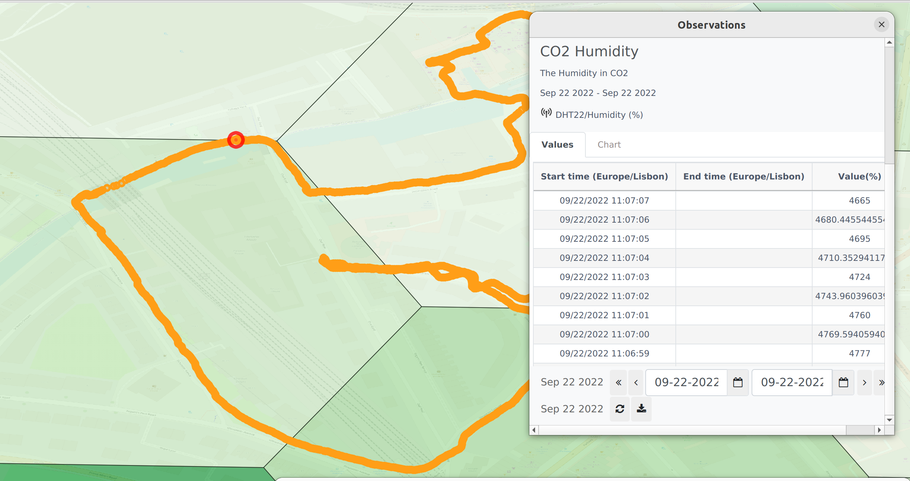

# OGC Pilot

Support files for the [Urban Digital Twins Interoperability Pilot](https://portal.ogc.org/files/?artifact_id=108023 ) proposal.

## Digital Twins Standards on IPSME 

These are examples of Standards that could be integrated into IPSME.

On this proof of concept, we want to focus on a subset of these.

## eMOTIONAL Cities SDI

The eMOTIONAL Cities SDI exposes 96 public datasets in OGC API - Features, OGC API - Tiles, OGC API - Records, WFS, WMS and WMTS interfaces and GeoJSON, GML, GeoPackage and GeoParquet encodings. It also exposes aditional data in SensorThings API.

This is an example of SensorThings API streams of Temperature and Humidity, along with a OGC API - Features NDVI collection, in the city of London.

